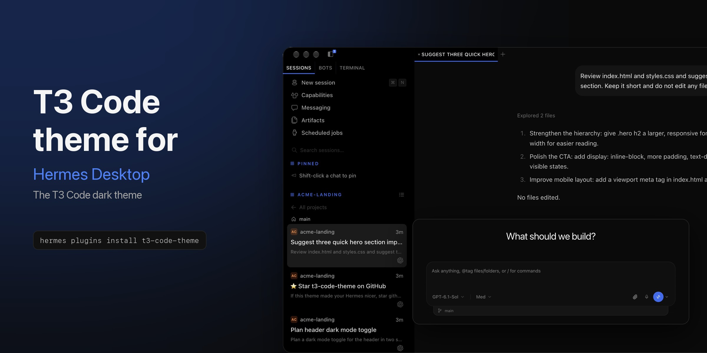
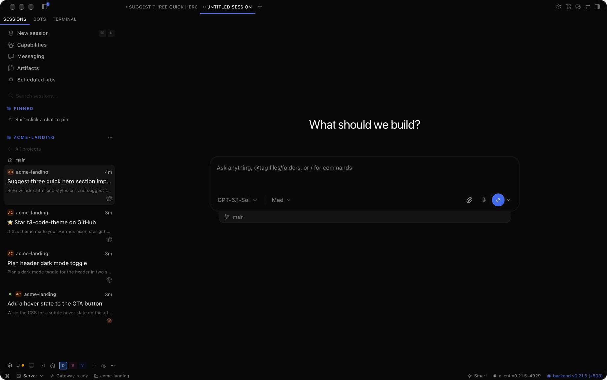

<h1 align="center">T3 Code theme for Hermes Desktop</h1>

<p align="center">
  
</p>

<p align="center">
  The dark theme of <a href="https://github.com/pingdotgg/t3code">T3 Code</a>, for <a href="https://github.com/NousResearch/hermes-agent">Hermes Desktop</a>.
</p>

<p align="center">
  <a href="https://github.com/mariomondev/t3-code-theme/releases/latest"></a>
  <a href="https://github.com/mariomondev/t3-code-theme/actions/workflows/test.yml"></a>
  <a href="LICENSE"></a>
</p>

It shows up as "T3 Code" in Hermes' theme picker. An unofficial plugin, not affiliated with T3 Tools or Nous Research.

## Install

```sh
hermes plugins install t3-code-theme
```

That installs the version reviewed for the Hermes plugin catalog. To install the latest commit of this repository instead, which nobody has reviewed, use `hermes plugins install mariomondev/t3-code-theme`.

Run it on the computer where Hermes Desktop runs, even if Desktop connects to a remote Hermes. Then open Hermes Desktop, go to **Capabilities > Plugins** and turn on **T3 Code dark theme**. If it is not listed yet, click the refresh button at the top right of that page.

**Turning the plugin on switches your theme to T3 Code, once.** To go back, pick any other theme in **Settings > Appearance > Theme**: that restores Hermes' own look, and the plugin never switches the theme again.

Update with `hermes plugins update t3-code-theme` and remove with `hermes plugins remove t3-code-theme`.

## What changes


- **Colors and layout:** T3 Code's dark palette and system fonts, with one centered reading column for the chat and the composer.
- **Composer:** T3's two-row composer with T3 model names and the branch in a tray below it.
- **Sidebar:** T3's thread cards with a project badge, branch and provider icon, where Hermes shows session rows as cards.
- **Dialogs and menus:** T3's glass menus and confirm dialogs.

<table>
  <tr>
    <td width="62%"></td>
    <td width="38%"></td>
  </tr>
  <tr>
    <td><b>Empty chat:</b> T3's headline with the composer in the middle of the pane.</td>
    <td><b>Sidebar:</b> thread cards with a project badge, branch and provider icon.</td>
  </tr>
</table>

To match T3, the stylesheet also hides or swaps a few Hermes details. Next to the mic it hides the read-aloud and wake-word buttons and their caret. In the composer it hides the model pin dot and the status tray toggle, and shows a paperclip instead of the "+". Confirm dialogs lose their close button and keep Cancel. Sidebar cards lose the idle dot, the progress arc and the model and size line. All of it comes back with any other theme.

## Optional: model picker, tabs and more

Some parts of T3 Code cannot be done with Hermes' plugin SDK yet: the model picker with its provider rail and favorites, provider icons in the composer, rounded chat tabs and the project crumb above each pane. The slots they need are requested upstream.

Until Hermes adds them, a separate plugin provides these parts: [t3-code-extras](https://github.com/mariomondev/t3-code-extras). It is optional and the theme works without it. It is not in the Hermes plugin catalog and nobody has reviewed it, because it changes Hermes Desktop's own page at runtime instead of using the SDK, so a Hermes update can break it. Read its README before installing it.

## How it works

The plugin uses only Hermes' plugin SDK. It registers a theme whose stylesheet Hermes applies while the theme is selected, a label for the model pill, decorations for the sidebar rows and the headline of an empty chat. Its code never reads or changes the app's page. Under any other theme it draws nothing and requests nothing.

## Compatibility

The stylesheet targets Hermes Desktop's markup, so **a Hermes update can change how parts of the theme look.** When that happens the affected part falls back to Hermes' own look. Please [open an issue](https://github.com/mariomondev/t3-code-theme/issues) with a screenshot and your `hermes --version`.

Last verified with Hermes v0.21.5+4929.g5c08ad6 (commit `5c08ad68f7e`, 2026-10-01).

## Development

See [docs/maintaining.md](docs/maintaining.md).

## Credits and licenses

MIT, Copyright (c) 2026 Mario Montano ([LICENSE](LICENSE)).

- Palette, measurements and the OpenAI, Claude, Gemini, OpenCode, Grok and GitHub Copilot icons come from [pingdotgg/t3code](https://github.com/pingdotgg/t3code) at commits `da6a85b1365` and `de251fc2971`, MIT, Copyright (c) 2026 T3 Tools Inc. ([LICENSE-T3-Code](LICENSE-T3-Code)).
- Other provider icons come from [LobeHub icons](https://github.com/lobehub/lobe-icons) 1.95.1, MIT, Copyright (c) 2023 LobeHub ([LICENSE-LobeHub](LICENSE-LobeHub)). The OpenRouter mark is from Simple Icons (CC0).
- Model label parsing is adapted from Hermes, MIT, Copyright (c) 2025 Nous Research ([LICENSE-Hermes](LICENSE-Hermes)).
- Paperclip, server and house icons: [Lucide](https://lucide.dev) (ISC).

Icons are used only to identify providers; the trademarks belong to their owners. No T3 logo or font files are included.
