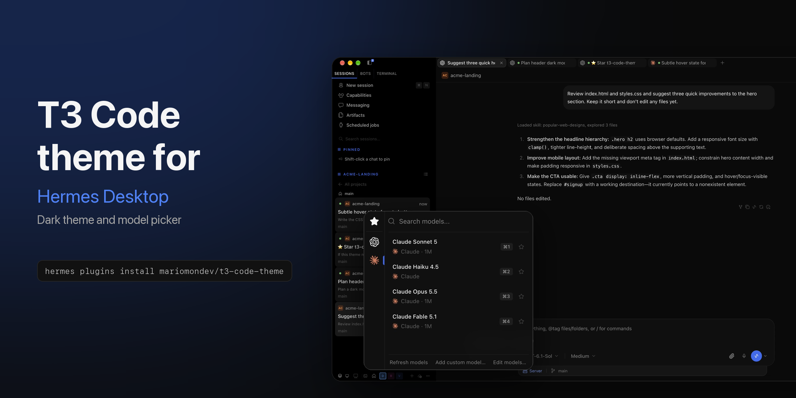
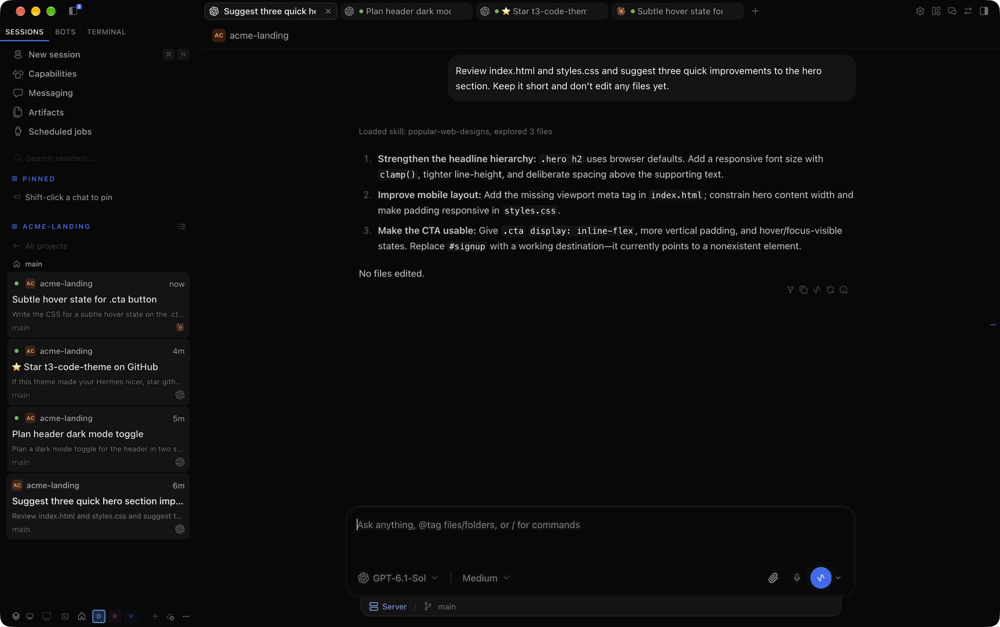
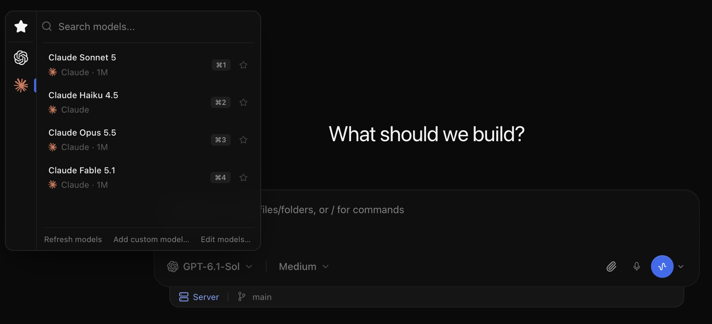
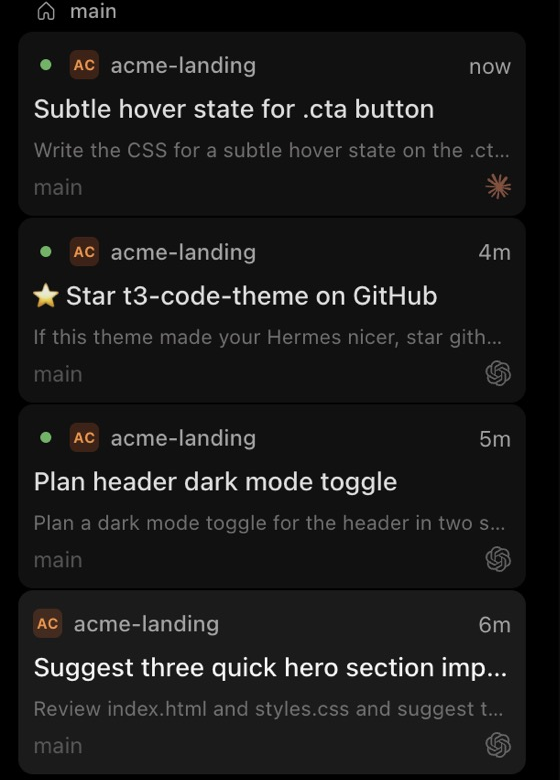

<h1 align="center">T3 Code theme for Hermes Desktop</h1>

<p align="center">
  
</p>

<p align="center">
  The dark theme and model picker of <a href="https://github.com/pingdotgg/t3code">T3 Code</a>, for <a href="https://github.com/NousResearch/hermes-agent">Hermes Desktop</a>.
</p>

<p align="center">
  <a href="https://github.com/mariomondev/t3-code-theme/releases/latest"></a>
  <a href="https://github.com/mariomondev/t3-code-theme/actions/workflows/test.yml"></a>
  <a href="LICENSE"></a>
</p>

It shows up as "T3 Code" in Hermes' theme picker. An unofficial plugin, not affiliated with T3 Tools or Nous Research.

## Install

```sh
hermes plugins install mariomondev/t3-code-theme
```

Then open Hermes Desktop, go to **Capabilities > Plugins** and turn on **T3 Code dark theme**. The desktop part of a plugin installs turned off.

Update with `hermes plugins update t3-code-theme` and remove with `hermes plugins remove t3-code-theme`. Choosing another theme restores Hermes' own look.

## What changes



- **Colors and layout:** T3 Code's dark palette and system fonts, with one centered reading column for the chat and the composer.
- **Composer:** T3's two-row composer, provider icons, T3 model names and a tray that shows the branch and where the chat runs.
- **Tabs and header:** rounded tabs with the provider icon of each chat, and a project crumb above each pane.
- **Dialogs and menus:** T3's glass menus and confirm dialogs.

<table>
  <tr>
    <td width="62%"></td>
    <td width="38%"></td>
  </tr>
  <tr>
    <td><b>Model picker:</b> a provider rail, search, favorites and <code>⌘1</code>-<code>⌘9</code> shortcuts. Picking a model still goes through Hermes, so its confirmations keep working.</td>
    <td><b>Sidebar:</b> T3's thread cards with a project badge, branch and provider icon.</td>
  </tr>
</table>

## Compatibility

The theme styles Hermes Desktop's markup, not only its plugin API, so **a Hermes update can break parts of it.** When that happens the affected part falls back to Hermes' own look and a warning names what is missing. Please [open an issue](https://github.com/mariomondev/t3-code-theme/issues) with that warning and your `hermes --version`.

Last verified with Hermes v0.21.5+4929.g5c08ad6 (commit `5c08ad68f7e`, 2026-09-30).

## Development

See [docs/maintaining.md](docs/maintaining.md).

## Credits and licenses

MIT, Copyright (c) 2026 Mario Montano ([LICENSE](LICENSE)).

- Palette, measurements and the OpenAI, Claude, Gemini, OpenCode, Grok and GitHub Copilot icons come from [pingdotgg/t3code](https://github.com/pingdotgg/t3code) at commits `da6a85b1365` and `de251fc2971`, MIT, Copyright (c) 2026 T3 Tools Inc. ([LICENSE-T3-Code](LICENSE-T3-Code)).
- Other provider icons come from [LobeHub icons](https://github.com/lobehub/lobe-icons) 1.95.1, MIT, Copyright (c) 2023 LobeHub ([LICENSE-LobeHub](LICENSE-LobeHub)). The OpenRouter mark is from Simple Icons (CC0).
- Model label parsing is adapted from Hermes, MIT, Copyright (c) 2025 Nous Research ([LICENSE-Hermes](LICENSE-Hermes)).
- Paperclip, search and star icons: [Lucide](https://lucide.dev) (ISC).

Icons are used only to identify providers; the trademarks belong to their owners. No T3 logo or font files are included.
